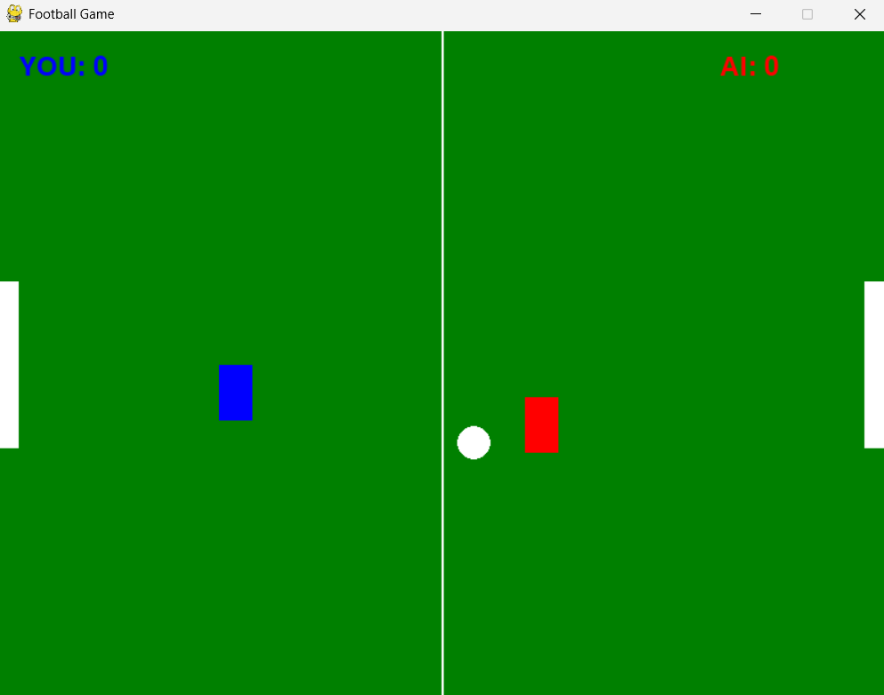

### Python Football Game Based on Reinforcement Learning

<div align="center"></div>

___


#### Project Structure
```text
football_game
├── rf 
    ├── football_env_ppo.py:  
        training environment for PPO with gymnasium style with 12d observation space
    ├── football_env_ppo_8d.py:  
        training environment for PPO with gymnasium style with 8d observation space
    ├── train_ppo.py: 
        train PPO with 12d observation space using stable-baselines3 
    ├── train_ppo_8d.py: 
        train PPO with 8d observation space using stable-baselines3
├── game
    ├── game_rule_based.py: 
        AI is rule-based
    ├── game_ppo.py: 
        AI using PPO to make decisions
    ├── game_hybrid.py: 
        AI using a hybrid strategy (rule-based and PPO)
├── test
    ├── test_ruleBased_ppo.py:
        Rule-based AI vs PPO AI
    ├── test_hybrid_ppo.py:
        Hybrid AI vs PPO AI
    ├── test_ppo_ppo.py:
        PPO-12d AI vs PPO-8d AI
    ├── test_hybrid_hybrid.py:
        2 AIs with different hybrid strategy
```
___

#### Environment Settings
1. Python >= 3.9 is required
```bash
conda create -n football python=3.9.13
```
```bash
conda activate football
```
2. Install required packages
```bash
pip install numpy matplotlib pygame gymnasium
```
3. PyTorch >= 2.3 is required
```bash
pip install torch==2.5.0 torchvision==2.5.0
```
4. Install stable-baselines3
```bash
pip install stable-baselines3[extra]
```
___

#### Training

1. Train PPO with 12d observation space
```bash
python path/to/rf/train_ppo.py
```
- Training logs will be saved at `path/to/rf/ppo_football_logs/`, you can use tensorboard to do visualization.
```bash
tensorboard --logdir path/to/rf/ppo_football_logs/tensorboard
```

2. Train PPO with 8d observation space
```bash
python path/to/rf/train_ppo_8d.py
```
- Training logs will be saved at `path/to/rf/ppo_football_logs2/`, you can use tensorboard to do visualization.
```bash
tensorboard --logdir path/to/rf/ppo_football_logs2/tensorboard
```
___

#### Run the Game
> Please run ***Train ppo with 12d observation space*** in **Training** section before running game: `game_ppo.py` and `game_hybrid.py`! 

Take `game_ppo.py` as example:
```bash
python path/to/game/game_ppo.py
```
___

#### Test the Game
> Please run ***Train ppo with 12d observation space*** and ***Train ppo with 8d observation space*** in **Training** section before doing test!

Take `test_ruleBesed_ppo.py` as example:
> **DO NOT** close the game window during the test!
```bash
python path/to/test/test_ruleBesed_ppo.py
```

