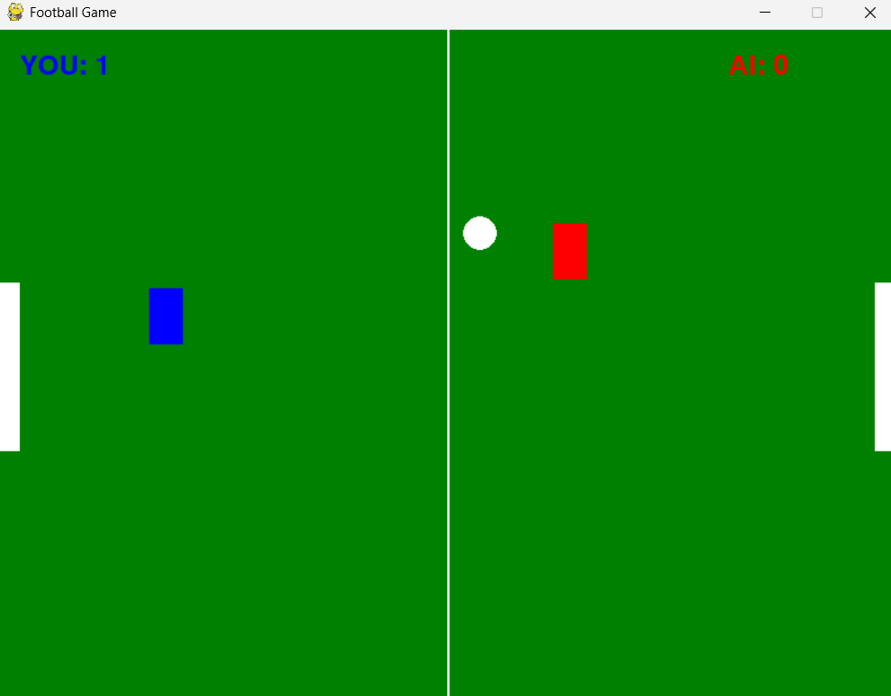
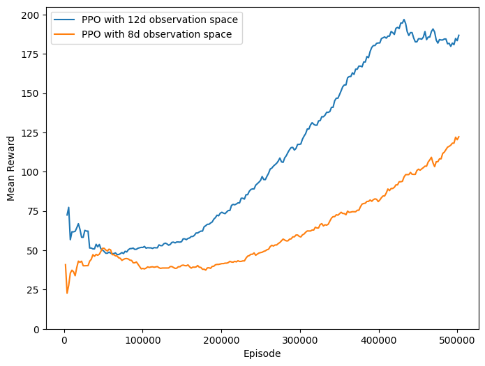

### 基于强化学习的Python足球游戏

<div style="text-align: center;"></div>

___
#### 项目结构
```text
football_game
|
├── football_env_ppo.py:  
|   用于训练PPO的足球游戏环境，使用gymnasium风格，12维观测空间
├── football_env_ppo_8d.py:  
|   用于训练PPO的足球游戏环境，使用gymnasium风格，8维观测空间
├── train_ppo.py: 
|   使用stable-baselines3训练12维观测空间的PPO
├── train_ppo_8d.py: 
|   使用stable-baselines3训练8维观测空间的PPO
|
├── game_rule_based.py: 
|   AI的策略只基于规则
├── game_ppo.py: 
|   AI通过PPO来进行决策
├── game_hybrid.py: 
|   AI使用混合策略(基于规则和PPO)
|
├── test_ruleBased_ppo.py:
|   基于规则的AI vs PPO AI
├── test_hybrid_ppo.py:
|   混合型AI vs PPO AI
├── test_ppo_ppo.py:
|   12维观测空间PPO AI vs 8维观测空间PPO AI
├── test_hybrid_hybrid.py:
|   2个使用不同混合策略的AI对战
```

#### 环境配置
1. Python版本需要 >= 3.9
```bash
conda create -n football python=3.9.13
```
```bash
conda activate football
```
2. 安装必要的依赖包
```bash
pip install numpy matplotlib pygame gymnasium
```
3. PyTorch版本需要 >= 2.3
```bash
pip install torch==2.5.0 torchvision==2.5.0
```
4. 安装stable-baselines3
```bash
pip install stable-baselines3[extra]
```

___

#### 训练

1. 训练12维观测空间的PPO
```bash
python path/to/train_ppo.py
```
- 训练日志将保存在 `./football_game/ppo_football_logs/`, 使用tensorboard可以进行可视化
```bash
tensorboard --logdir ppo_football_logs/tensorboard
```

2. 训练12维观测空间的PPO
```bash
python path/to/train_ppo_8d.py
```
- 训练日志将保存在 `./football_game/ppo_football_logs2/`, 使用tensorboard可以进行可视化
```bash
tensorboard --logdir ppo_football_logs2/tensorboard
```
___
#### 运行游戏
> 在运行游戏`game_ppo.py` and `game_hybrid.py`之前，请先运行**训练**章节的***训练12维观测空间的PPO***!

以`game_ppo.py`为例:
```bash
python path/to/game_ppo.py
```

<div style="text-align: center;"></div>

___

#### 测试

> 在进行测试之前，请先运行**训练**章节的***训练12维观测空间的PPO***和***训练8维观测空间的PPO***!

以`test_ruleBesed_ppo.py`为例:
> 测试过程中**请勿关闭**游戏窗口!
```bash
python path/to/test_ruleBesed_ppo.py
```